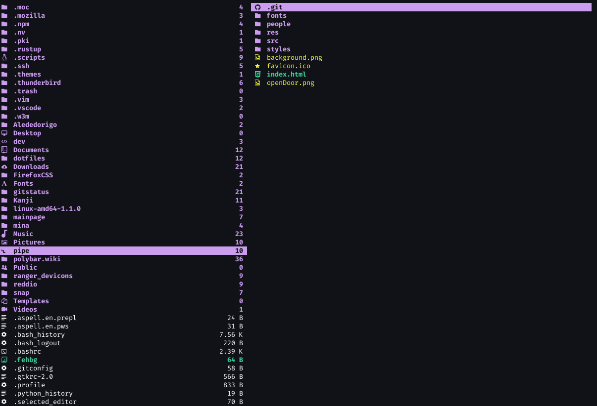

# File icons for the Ranger file manager

This is a fork for [alexanderjeurissen/ranger-devicons](https://github.com/alexanderjeurissen/ranger_devicons).
I added:
* Some space between the icons and the file/directory;
* Some icons for many extenson.

This plugin introduces a new linemode that prefixes file names with a file icon



## Prerequisites
This plugin uses glyphs from a patched NERDfont. So in order for this plugin to work you need to
install a NERDfont and set it as the default font for your terminal.

I personally use the Source Code Pro patched NERDfont(this is also the font displayed in the
screenshot), this and other NERDfonts and the install instructions for these fonts can be found in
the following repository: https://github.com/ryanoasis/nerd-fonts

Also you can use [FontAwesome](https://fontawesome.com/v4.7.0/cheatsheet/), simply install it in your computer.
On Ubuntu you can install it with ``` sudo apt install font-font-awesome ```
On Arch you can install it with ``` sudo pacman -S ttf-font-awesome ```

## Install instructions
Ranger has added support for loading directories in the plugins folder which makes it easier to install and keep plugins updated.
To install, just clone the repo into the plugins folder:
```bash
git clone https://github.com/alededorigo/ranger_devicons ~/.config/ranger/plugins/ranger_devicons
```

Then execute the following `echo "default_linemode devicons" >> $HOME/.config/ranger/rc.conf` (or wherever your `rc.conf` is located).
